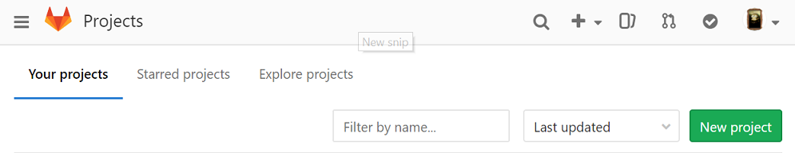
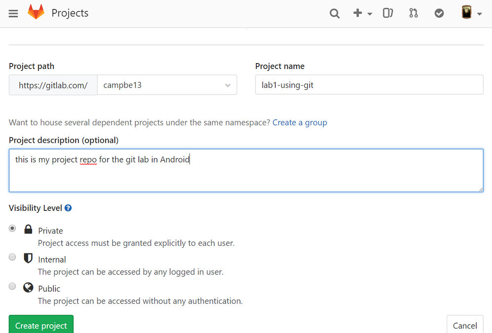
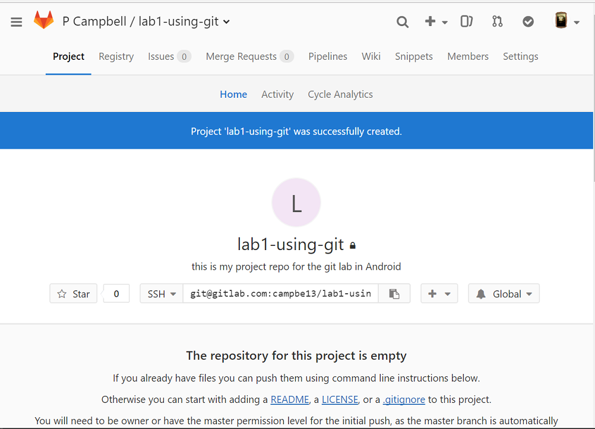
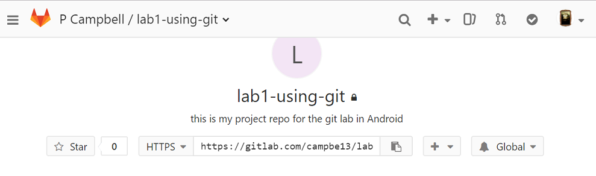
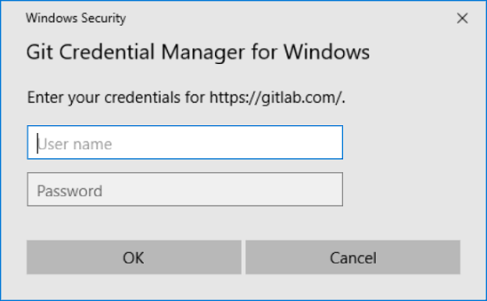
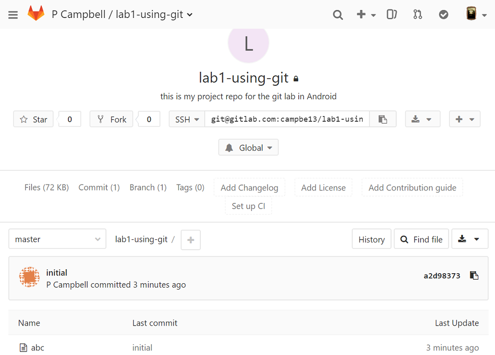

# Git Tutorial, Part 1

Summary: create a local repository, make commits, set up a remote repository,
push to and pull from the remote.

Commands shown: `git init`, `git status`, `git add`, `git commit`, `git diff`,
`git log`, `git clone`, `git remote`, `git push`, `git pull`

## What does git do?

git is a client-server version control system.

* It keeps track of file history in terms of __commits__, also known as
__revisions__. Every time you want to save a snapshot of your repository files
in the history, you use git to create a commit.
* This allows you (and teammates) to work on different aspects of a big project
at the same time, without stepping on each other's toes.

The client is the git command, the server is any repo server
<http://github.com>, <https://bitbucket.org/>, <http://gitlab.com>, or
one that you host yourself, etc.

The examples in here use github and gitlab but could easily be swapped for bitbucket.

### "local" versus "remote"

* A __local__ repo is one that is on your computer. It is possible to use git
only locally, and never even communicate with a server. In that case, you get
the benefit of version control and history for yourself, but you can't
collaborate with anyone.
* A __remote__ repo is one that is hosted on a server like gitlab.com. By pushing
a copy of your local repo to a remote repo, you get a back-up of your files
on the server and therefore can access them any other computer. This also allows
you to share your repo with others and collaborate.

### Resources

* If you already know how to use git but can't remember some sequence
check here [git quick ref](http://wiki.pcampbell.profweb.ca/index.php/Git_quick_ref)
* This is all command line. If you re having trouble remembering the bash
command line here are some
[references](https://drive.google.com/open?id=0B-CHlg81QPjfVU5PSkxYM1hsSEE)
<http://bit.ly/bashqr>

## Configure git

Configure your git client side (the repo will exist first locally then
also remotely).

Open a git-bash command line window & configure your client. (In the labs
this will configure the git client info in the H: drive.)
If you are
running on Linux just make sure git is installed.

If this is your first time using git, then set up the config with the
information you will include in each commit. If you have an account
on a remote repo hosting service like github/gitlab, use the email same
email address as for that account:

``` {.bash}
$ git config --global user.name "Grace Hopper"
$ git config --global user.email "gracie@ilovelinux.ca"
$ git config --global color.ui "auto"
```

These settings go into `~/.gitconfig` and apply to all the
repos that you create. To check the settings.

``` {.bash}
$ git config --list
```

> To get help with any command, add ``-h` or `--help` to it.

``` {.bash}
$ git config -h
$ git config --help
```

## Create a local repo[^sccreate]

[^sccreate]: ref <http://swcarpentry.github.io/git-novice/03-create/>

We are going to make an example local repository. Do this on
the h: drive

``` {.bash}
$ mkdir planets
$ cd planets
```

Make the directory into a git repository; cwd is h:\\planets

``` {.bash}
$  git init .
Initialized empty Git repository in planets/.git/
```

>A git repo is just a directory that contains a `.git` directory as well as
whatever files you want to keep track of.
>The `.git` directory is where `git` keeps track of all the file history and other
meta-data of the files in `planets`. You pretty much never have to do anything
_in_ the `.git` directory: that's what git commands do for you.

Check that there's an `.git` directory in `planets`, and check the status
of the repository.

```
$ ls -a   
.  ..  .git
$ git status
```

``` {.bash}
# On branch master <--- we'll learn about branches later
#
# Initial commit
#
nothing to commit (create/copy files and use "git add" to track)
```

_Use `git status` often: it can give you hints about how to fix mistakes._

## Add files to the repo[^swcchanges]

[^swcchanges]:  <http://swcarpentry.github.io/git-novice/04-changes/>

Create a file in the planets directory

``` {.bash}
$ vi pluto.txt   #  put some text in here "alas it is no more"  & save it
$ git status
```

``` {.bash}
# On branch master
#
# Initial commit
#
# Untracked files:
#   (use "git add <file>..." to include in what will be committed)
#
#   pluto.txt
nothing added to commit but untracked files present (use "git add" to track)
```

git does not pay attention to changes in a file until you `add` it to the repo. This
tells git to "stage" your file in the __index__: the index represents the changes
that will be recorded in your repo history if you decide to commit them. Another
term for the index is __staging area__.

``` {.bash}
$ git add pluto.txt
$ git status
```

``` {.bash}
# On branch master
#
# Initial commit
#
# Changes to be committed:
#   (use "git rm --cached <file>..." to unstage)
#
#   new file:   pluto.txt
#
```

#### Possible status of files in a git repo
`untracked`:
Files that aren't tracked by Git yet. This usually indicates a newly created file.

`staged` (in the index):
The result of `git add`; tracked files that are ready to be committed.

`unstaged` (not in the index):
Tracked files with changes that have not been "git-added".


You can see the staged changes as follows:

```{.bash}
git diff --staged
```

## Create commits

Tell git save a snapshot of file history by recording the changes that you
added to the index.

``` {.bash}
$ git commit -m "Create first planet file."
```

The message "Create first planet file" describes the changes made by that
commit.


``` {.bash}
[master (root-commit) f22b25e] Create first planet file.
 1 file changed, 1 insertion(+)
 create mode 100644 pluto.txt
```

Make sure it committed ok

``` {.bash}
$ git status
```

``` {.bash}
# On branch master
nothing to commit, working directory clean
```

Show all commits in reverse chronological order:

``` {.bash}
$ git log
```

``` {.bash}
commit f22b25e3233b4645dabd0d81e651fe074bd8e73b
Author: Grace Hopper <gracie@ilovelinux.ca>
Date:   Thu Aug 22 09:51:46 2013 -0400

    Create first planet file.
```

> The commit stores the date, author, and changes made. Every commit is identified by a
> unique hash. In
> the above example it's, `f22b25e3233b4645dabd0d81e651fe074bd8e73b`. Because of how
> these hashes are defined, you can assume that the first few characters in the hash are
> unique, so it's also accurate to refer to this commit as `f22b25e3` or
> `f22b25e3233b4645dabd0d`. You'll see these abbreviated hashes in some git output, as
> well as on websites like github.com.

#### Commit messages

It is a widely adopted practice to start commit messages with a
imperative verb, so that each message sounds like a command or a step in an
algorithm: "List all passengers by name.", "Remove multiplication method."
This makes the history easier to read when use `git log` and other tools.

## More commits!

You just committed a new file. What does it look like when you commit
changes to an already-tracked file?

``` {.bash}
$ vi pluto.txt   #  add a new line of text "we miss you pluto"  & save it
$ git status
```

``` {.bash}
# On branch master
# Changes not staged for commit:
#   (use "git add <file>..." to update what will be committed)
#   (use "git checkout -- <file>..." to discard changes in working directory)
#
#   modified:   pluto.txt
#
no changes added to commit (use "git add" and/or "git commit -a")
```

Look at the changes before saving them; git detects that it doesn't match
what is in the first commit

``` {.bash}
git diff
```

Output of git diff:

``` {.bash}
diff --git a/pluto.txt b/pluto.txt
index 9f83956..0ce4e22 100644
--- a/pluto.txt
+++ b/pluto.txt
@@ -1 +1,2 @@
 alas it is no more
+we miss you pluto
```

So now try to commit:

``` {.bash}
$ git commit -m "Add sentiment"
On branch master
Changes not staged for commit:
    modified:   pluto.txt

no changes added to commit

$ git status
```

NOPE!

``` {.bash}
# On branch master
# Changes not staged for commit:
#   (use "git add <file>..." to update what will be committed)
#   (use "git checkout -- <file>..." to discard changes in working directory)
#
#   modified:   pluto.txt
#
no changes added to commit (use "git add" and/or "git commit -a")
```

We need to add it to the index (staging area) before committing: __always add then commit__

``` {.bash}
$ git add pluto.txt
$ git commit -m "Add sentiment"
```

Success!

``` {.bash}
[master 340b5d6] add sentiment
 1 file changed, 1 insertion(+)
```

So getting files into a repo is a two-part process:

untracked changes --(git add)-&gt; staging area --(git commit)--&gt; repository


> You might be thinking: if each commit is a snapshot of file history, that
> must take up so much extra space! It's not too bad, actually: a git commit
> doesn't story any actual file copies; instead it only stores the _changes_
> made. So if you only change one line in one file and commit, the commit
> will only store the original line, its location in the file, and the line added.
> This is what we see with the `git diff` command.

## Set up a server side repo (a remote repo)

These instructions focus on gitlab, but the process is very similar with
other hosts like github or bitbucket. If you want to see github screenshots, see [github instructions](01_basics_github.md)

You will create an empty public repo and then "push" your
local repo to that public location, effectively making a remote copy.

> In this exercise, your remote repo will be _public_. In future
> graded assignments, you will be asked to create
> _private_ remote repos. Be careful when you choose to make
> repo of your coursework public, since that is most-likely a violation
> of __academic integrity__. Publishing or sharing graded work with
> current or future students is unfair and devalues students' hard work.

If you don't have a gitlab account create one <https://gitlab.com/users/sign_in>.

1.  Create a new Project repo click
    on Project Dashboard then __New Project__ button:
    
2.  Fill in the form to create a public project called __planets__.
    
3.  If the repo is created properly you will see this;
     (Do NOT create a README nor any other files)
    

Now you have an empty repo called planets on the gitlab server.
Effectively you just did this on gitlab, but through their web UI:

        ``` {.bash}
        mkdir planets;cd planets;git init .
        ```

## Add a remote

We need to connect our local repo to our remote repo. We must tell the local repo
to talk to a remote repo on gitlab.com. This is called __adding a remote__.

> It is better to use ssh but you will need to set up keys for that, https you
> can use userid/password. So we'll use https for now.

Note: server side == remote && client side == local

From the website copy the https url into your clipboard


Go to your local repo directory (git-bash command line)

Below shows my repo URL, use your own
``` {.bash}
# go into repository directory (you already did a git init here)
$ cd planets

# add a remote with name "origin" and url you copies
$ git remote add origin https://gitlab.com/campbe13/lab1-using-git.git

# verify it
$ git remote -v
origin  https://gitlab.com/campbe13/lab1-using-git.git (fetch)
origin  https://gitlab.com/campbe13/lab1-using-git.git (push)
```

> "origin" is a standard name for the primary remote used by your
> local repo. We could have used any string for this label.

## Push to the remote

Now that the local (client) repo knows about the remote (server) repo, let's
sync them. You remote repo on gitlab is empty, so let's send your history
from the local repo to the remote repo.

`git push` is the command for sending data to a remote. Below, we know
"origin" represents the URL to planets.git on gitlab.com.

>We'll explain what "master" is next time, but for now you can think of "master"
> as a label the most recent commit you made.

Note we have previously added and committed the files in the staging area.

``` {.bash}
$ git push origin master
```

So this command is saying: take all the commits in history up to the point
labeled "master" and send them to the remote called "origin"

We need to authenticate on the server:

``` {.bash}
Counting objects: 3, done.
Delta compression using up to 4 threads.
Compressing objects: 100% (2/2), done.
Writing objects: 100% (3/3), 214 bytes | 0 bytes/s, done.
Total 3 (delta 0), reused 0 (delta 0)
To https://gitlab.com/campbe13/lab1-using-git.git
 * [new branch]      master -> master
```

Reload the project page: you should see that your local history is now on the
server.



## Review: add, commit, push

Add a README.md, for now just put in some basic text, you can get more
sophisticated later, with markdown
<https://help.github.com/articles/basic-writing-and-formatting-syntax/>

Example below:

``` {.bash}
tricia@ubbie:~/planets$ echo "My first repo" > README.md
tricia@ubbie:~/planets$ git add README.md
tricia@ubbie:~/planets$ git commit -m "add readme"
[master ef2c0b8] add readme
 1 file changed, 1 insertion(+)

 create mode 100644 README.md
tricia@ubbie:~/planets$ git push origin master
Counting objects: 3, done.
Delta compression using up to 4 threads.
Compressing objects: 100% (2/2), done.
Writing objects: 100% (3/3), 284 bytes | 0 bytes/s, done.
Total 3 (delta 0), reused 0 (delta 0)
To https://github.com/campbe13/planets.git
   340b5d6..ef2c0b8  master -> master
```

Reload the project page it will show you the README.md

##  Using your repo from a new computer

Up to now you have a planets.git repo in your h: drive (local), a
planets.git repo on gitlab.com (remote) and they are identical because
you pushed all your local changes to the remote.

Let's say you want to work on the `planets.git` repo on another computer.
To do that, you first have to __clone__ the repository from the remote server.

### clone

__You would normally do this part from a different computer outside of the
lab, but we can simulate it by using a different directory on the same computer.__
To do so in the lab, create a directory called _imaginaryOtherComputer_ in your
h:drive and cd to it.

Now copy the https url from the planets repo project page in your gitlab account
and use `git clone` as you see below:

``` {.bash}
$ git clone https://github.com/campbe13/planets.git
Cloning into 'planets'...
remote: Counting objects: 9, done.
remote: Compressing objects: 100% (4/4), done.
remote: Total 9 (delta 0), reused 9 (delta 0), pack-reused 0
Unpacking objects: 100% (9/9), done.
Checking connectivity... done.

$ cd planets
$ ls -l
total 8
-rw-rw-r-- 1 tricia tricia 38 Aug 28 19:51 pluto.txt
-rw-rw-r-- 1 tricia tricia 14 Aug 28 19:51 README.md
```

Because my repo is called planets.git, this command creates a new __planets__
directory in the current directory (_imaginaryOtherComputer_ directory).

> When you clone you get a copy of the whole repository and all its history
> in a directory named after the repository. By default, cloning will
> set up a remote called "origin" for you that points to where you cloned from.

So now you have 3 identical copies of this repository:
1. on your h: drive
2. on gitlab
3. on your home computer (or wherever you cloned just now, like the _imaginaryOtherComputer_ directory).

### Collaborate... with your future self.

In this scenario, every time you commit changes locally, you will push them to
the remote so you can access your latest changes wherever you are working next
time.

Modify some files in the repo you just cloned, and/or create new ones.
I added `home-planet.txt` and changed `README.md`

> This only changes the local files! It does not affect anything on the other
> copies of this repo (remote, or other local.)

``` {.bash}
$ vi home-planet.txt
$ ls -l
total 12
-rw-rw-r-- 1 tricia tricia 32 Aug 28 19:54 home-planet.txt
-rw-rw-r-- 1 tricia tricia 38 Aug 28 19:51 pluto.txt
-rw-rw-r-- 1 tricia tricia 14 Aug 28 19:51 README.md
$ vi README.md
$ git diff
diff --git a/README.md b/README.md
index b85b88f..cc8bdcd 100644
--- a/README.md
+++ b/README.md
@@ -1 +1,3 @@
 My first repo
+
+modified Saturday to fix the thingy error
$ git add .
$ git status
On branch master
Your branch is up-to-date with 'origin/master'.
Changes to be committed:
  (use "git reset HEAD <file>..." to unstage)

    modified:   README.md
    new file:   home-planet.txt
```

Remember `add` will update the staging area (the index), `commit` will save
history in the local repo

``` {.bash}
$ git commit -m "done for today will work from school tomorrow"
[master c3993b1] done for today will work from school tomorrow
 2 files changed, 3 insertions(+)
 create mode 100644 home-planet.txt
```

If I want to use it from school tomorrow I need to push these changes to
the remote repo.

``` {.bash}
$ git push origin master
...
Counting objects: 4, done.
Delta compression using up to 4 threads.
Compressing objects: 100% (3/3), done.
Writing objects: 100% (4/4), 432 bytes | 0 bytes/s, done.
Total 4 (delta 0), reused 0 (delta 0)
To https://github.com/campbe13/planets.git
   ef2c0b8..c3993b1  master -> master
```

Now the remote (server) gitlab repo contains my latest changes.

### Using your repo back on the first computer (in the lab)

__You would normally do this part from a different computer, but we can simulate it by using a different directory on the same computer.__ To do so in the lab, cd back to
where you originally created the planets repo on your h: drive at the beginning of this
tutorial.

So you committed a change in the repo at home, pushed to your remote, and now
you want to work on the repo in the school lab again. Your home and remote
repo are up-to-date, but your lab repo is not. How do you get the
changes you made at home? Follow the example below.

Before you make any new changes in your local lab repo, make sure you sync it
with any changes from the remote (gitlab) with `git pull`.

``` {.bash}
$ ls
pluto.txt  README.md
$ git pull origin master
From https://gitlab.com/campbe13/planets
 * branch            master     -> FETCH_HEAD
Updating ef2c0b8..c3993b1
Fast-forward
 README.md       | 2 ++
 home-planet.txt | 1 +
 2 files changed, 3 insertions(+)
 create mode 100644 home-planet.txt
```

Now your local repo matches the remote (gitlab) and you can add new
changes and to the remote again as needed.

``` {.bash}
$ ls -l
total 12
-rw-rw-r-- 1 tricia tricia 32 Aug 28 20:07 home-planet.txt
-rw-rw-r-- 1 tricia tricia 38 Aug 28 17:12 pluto.txt
-rw-rw-r-- 1 tricia tricia 57 Aug 28 20:07 README.md
```

I added important-work.txt and updated home-planet.txt

``` {.bash}


$ git status
On branch master
Your branch is up-to-date with 'origin/master'.
Changes not staged for commit:
  (use "git add <file>..." to update what will be committed)
  (use "git checkout -- <file>..." to discard changes in working directory)

    modified:   home-planet.txt

Untracked files:
  (use "git add <file>..." to include in what will be committed)

    important-work.txt

no changes added to commit (use "git add" and/or "git commit -a")
```

So I need to add the new file (stage), then commit them (save history in local
repo)

``` {.bash}
$ git add .
$ git commit -m "Add important new stuff."
[master f843520] Add important new stuff.
 2 files changed, 3 insertions(+)
 create mode 100644 important-work.txt
$ git status
On branch master
Your branch is ahead of 'origin/master' by 1 commit.
  (use "git push" to publish your local commits)
nothing to commit, working directory clean
```

Then I need to push to my remote (gitlab) to update it.

> Recall: "origin" is just a label for the remote URL.

``` {.bash}
$ git push origin master
...
Counting objects: 4, done.
Delta compression using up to 4 threads.
Compressing objects: 100% (3/3), done.
Writing objects: 100% (4/4), 440 bytes | 0 bytes/s, done.
Total 4 (delta 0), reused 0 (delta 0)
To https://gitlab.com/campbe13/planets.git
   c3993b1..f843520  master -> master
```

### Ahhh! What happens if I forget to pull from `origin` before I commit new changes locally!!

Don't worry, you can fix pretty much any mistake you make in git, although it might
be a bit tricky sometimes.

If you pull after you've already made commits locally, you will either "merge"
or "rebase" the commits. You may also have to fix some "conflicts". You can
even "rewrite history". These are
all things that we'll practice later on, so for now just ask me for help. :)
