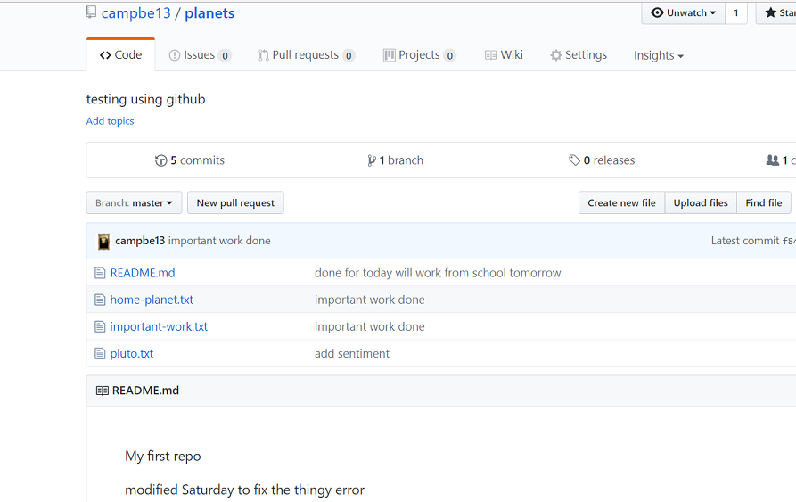

If you're using github for your [first exercise](01_basics.md),
follow these instructions to start. Overall, the process on gitlab and github
is very similar.

### Creating an empty repo
1.  If you don't have a github account create one
    <https://github.com/join?source=header-home>
2.  To create a new repo click
    on the plus sign:
    _(Do NOT create a README nor any other files)_
    

3.   If the repo is created properly you will see this;
    

Now you have an empty repo called planets on the github server.
    Effectively you just did this on github, but through their web UI:

            ``` {.bash}
            mkdir planets;cd planets;git init .
            ```

### After you have pushed to your remote repo


