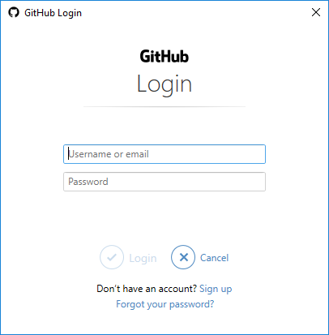
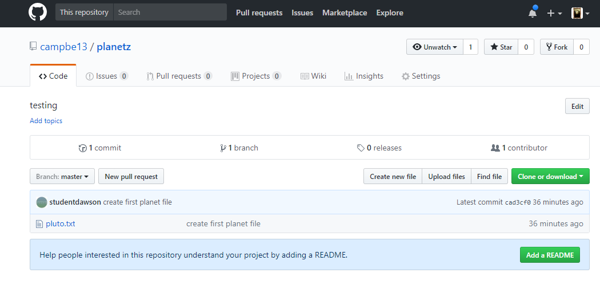

<!-- START doctoc generated TOC please keep comment here to allow auto update -->
<!-- DON'T EDIT THIS SECTION, INSTEAD RE-RUN doctoc TO UPDATE -->
**Table of Contents**  *generated with [DocToc](https://github.com/thlorenz/doctoc)*

- [Git Tutorial, Part 1](#git-tutorial-part-1)
  - [0 Configure git](#0-configure-git)
  - [1 Create a local repo](#1-create-a-local-repo)
  - [2 Add files to the repo](#2-add-files-to-the-repo)
  - [3 Create commits](#3-create-commits)
    - [Commit messages](#commit-messages)
    - [More commits!](#more-commits)
  - [4 Set up a server side repo (a remote repo)](#4-set-up-a-server-side-repo-a-remote-repo)
    - [Creating an empty repo on a server](#creating-an-empty-repo-on-a-server)
  - [5 Add the name of a remote to your local repo](#5-add-the-name-of-a-remote-to-your-local-repo)
  - [6 Upload the local repo to the remote repo](#6-upload-the-local-repo-to-the-remote-repo)
  - [7 Using your repo from a new computer](#7-using-your-repo-from-a-new-computer)
    - [Clone](#clone)
    - [Collaborate... with your future self.](#collaborate-with-your-future-self)
    - [Using your repo back on the first computer (in the lab)](#using-your-repo-back-on-the-first-computer-in-the-lab)

<!-- END doctoc generated TOC please keep comment here to allow auto update -->

# Git Tutorial, Part 1

Summary: create a local repository, make commits, set up a remote repository,
push to and pull from the remote.

Commands shown: `git init`, `git status`, `git add`, `git commit`, `git diff`,
`git log`, `git clone`, `git remote`, `git push`, `git pull`

## 0 Configure git

Open a git-bash command line window & configure your client. (In the labs
this will configure the git client info in the H: drive.)

``` {.bash}
$ git config --global user.name "your name"
$ git config --global user.email "you@dawsoncollege.qc.ca"
$ git config --global color.ui "auto"
```

These settings will be written into `~/.gitconfig` and apply to all the
repos that you create. To check the settings.

``` {.bash}
$ git config --list
```

> To get help with any command, add ``-h` or `--help` to it.

``` {.bash}
$ git config -h
$ git config --help
```
##  1 Create a local repo

(Adapted from: <http://swcarpentry.github.io/git-novice/03-create/>)

We are going to make an example local repository. Do this on
the h: drive in the lab, it may be done anywhere in reality.

``` {.bash}
$ mkdir planets
$ cd planets
```

Make the directory into a git repository; pwd is h:\\planets

``` {.bash}
$ pwd
/h/planets
$  git init .
Initialized empty Git repository in H:/planets/.git/
```

>Now h:\\planets is a git repo

Check that there's a `.git` directory in `planets`, and check the status
of the repository.

```
$ ls -a   
.  ..  .git
$ git status
On branch master  <--- we'll learn about branches later

Initial commit

nothing to commit (create/copy files and use "git add" to track)
```

_Use `git status` often: it can give you hints about how to fix mistakes._

## 2 Add files to the repo

(Adapted from: <http://swcarpentry.github.io/git-novice/04-changes/>)

Create a file in the planets directory

``` {.bash}
$ atom .              #  create a new file pluto.txt put some text in here "alas it is no more"  
                      #  save & close it
$ git status

On branch master

Initial commit

Untracked files:
 (use "git add <file>..." to include in what will be committed)
       pluto.txt
nothing added to commit but untracked files present (use "git add" to track)
```

git does not pay attention to changes in a file until you `add` it to the repo.

``` {.bash}
$ git add pluto.txt
$ git status  
On branch master

Initial commit

Changes to be committed:
   (use "git rm --cached <file>..." to unstage)

   new file:   pluto.txt

```
You can see what is about to be committed

```{.bash}
$ git diff --staged

diff --git a/pluto.txt b/pluto.txt
new file mode 100644
index 0000000..d91f233
--- /dev/null
+++ b/pluto.txt
@@ -0,0 +1 @@
+alas it is no more
\ No newline at end of file
```

## 3 Create commits

Tell git to save a snapshot of file history.

``` {.bash}
$ git commit -m "Create first planet file."
[master (root-commit) f22b25e] Create first planet file.
 1 file changed, 1 insertion(+)
 create mode 100644 pluto.txt
```

Make sure it committed ok

``` {.bash}
$ git status
On branch master
nothing to commit, working directory clean
```

Show all commits in reverse chronological order

``` {.bash}
$ git log
```

``` {.bash}
commit cad3cf0a910669827d1040fcf2e960090a316a79 (HEAD -> master)
Author: Grace Hopper <gracie@ilovelinux.ca>
Date:   Thu Aug 22 09:51:46 2013 -0400

    Create first planet file.
```

### Commit messages

``` {.bash}
$ git commit -m "Create first planet file.
```
### More commits!

Make and  commit changes to an already-tracked file

``` {.bash}
$ atom pluto.txt   #  add a new line of text "we miss you pluto"  & save it
$ git status
# On branch master
# Changes not staged for commit:
#   (use "git add <file>..." to update what will be committed)
#   (use "git checkout -- <file>..." to discard changes in working directory)
#
#   modified:   pluto.txt
#
no changes added to commit (use "git add" and/or "git commit -a")
```

Look at the changes before saving them; git detects that it doesn't match
what is in the first commit

``` {.bash}
git diff
diff --git a/pluto.txt b/pluto.txt
index 9f83956..0ce4e22 100644
--- a/pluto.txt
+++ b/pluto.txt
@@ -1 +1,2 @@
 alas it is no more
+we miss you pluto
```

So now try to commit:

``` {.bash}
$ git commit -m "Add sentiment"
On branch master
Changes not staged for commit:
    modified:   pluto.txt

no changes added to commit
```

NOPE!

``` {.bash}
$ git status
# On branch master
# Changes not staged for commit:
#   (use "git add <file>..." to update what will be committed)
#   (use "git checkout -- <file>..." to discard changes in working directory)
#
#   modified:   pluto.txt
#
no changes added to commit (use "git add" and/or "git commit -a")
```

__always add then commit__

``` {.bash}
$ git add pluto.txt
$ git commit -m "Add sentiment"
```

Success!

``` {.bash}
[master 340b5d6] add sentiment
 1 file changed, 1 insertion(+)
```
## 4 Set up a server side repo (a remote repo)

You will create an empty public repo on github and then "push" your
local repo to that public location, effectively making a remote copy.

### Creating an empty repo on a server
1.  If you don't have a github account create one
    <https://github.com/join?source=header-home>
2.  Logon to the github site.
3.  To create a new repo click
    on the plus sign
    _(Do NOT create a README nor any other files)_

Now you have an empty repo called planets on the github server.

## 5 Add the name of a remote to your local repo

We connect the local repo to the remote repo on github.com. This is called __adding a remote__.

From the website copy the https url into your clipboard


Go to your local repo directory (git-bash command line)

Below shows my repo URL, use your own
``` {.bash}
# go into repository directory (you already did a git init here)
$ cd /h/planets

# add a remote with name "origin" and the url from the website
$ git remote add origin https://github.com/YOURID/planets.git

# view it to verify
$ git remote -v
origin  https://github.com/YOURID/planets.git (fetch)
origin  https://github.com/YOURID/planets.git (push)
```

## 6 Upload the local repo to the remote repo

Now that the local repo knows about the remote repo, let's
sync them.

`git push` is the command for sending data to a remote.

``` {.bash}
$ git push origin master
```

We need to authenticate on the server:


``` {.bash}
Counting objects: 3, done.
Delta compression using up to 4 threads.
Compressing objects: 100% (2/2), done.
Writing objects: 100% (3/3), 214 bytes | 0 bytes/s, done.
Total 3 (delta 0), reused 0 (delta 0)
To https://github.com/YOURID/planets.git
 * [new branch]      master -> master
```

On the website, reload the project page: you should see that your local history is now on the
server.



## 7 Using your repo from a new computer


Let's say you want to work on the `planets.git` repo on another computer.
To do that, you first have to __clone__ the repository from the remote server.

### Clone

__You would normally do this part from a different computer outside of the
lab, but we can simulate it by using a different directory on the same computer.__
To do so in the lab, create a directory called _imaginaryOtherComputer_ in your
h: drive and cd to it.

Again copy the https url from the planets repo project page in your github account
and use `git clone` as you see below:

``` {.bash}
$ cd  /h
$ mkdir imaginaryOtherComputer
$ cd imaginaryOtherComputer
$ git clone https://github.com/yourid/planets.git
Cloning into 'planets'...
remote: Counting objects: 9, done.
remote: Compressing objects: 100% (4/4), done.
remote: Total 9 (delta 0), reused 9 (delta 0), pack-reused 0
Unpacking objects: 100% (9/9), done.
Checking connectivity... done.

$ cd planets
$ ls -l
total 8
-rw-rw-r-- 1 tricia tricia 38 Aug 28 19:51 pluto.txt
-rw-rw-r-- 1 tricia tricia 14 Aug 28 19:51 README.md
```

Because my repo is called planets.git, this command creates a new __planets__
directory in the current directory (_imaginaryOtherComputer_ directory).

By default, cloning will
set up a remote called "origin" for you that points to the remote URL you cloned from.
``` {.bash}
$ git remote -v
origin  https://github.com/YOURID/planets.git (fetch)
origin  https://github.com/YOURID/planets.git (push)
```
### Collaborate... with your future self.

Modify some files in the repo you just cloned, and create new ones.

I added `home-planet.txt` and changed `README.md`

``` {.bash}
$ atom home-planet.txt
$ ls -l
total 12
-rw-rw-r-- 1 tricia tricia 32 Aug 28 19:54 home-planet.txt
-rw-rw-r-- 1 tricia tricia 38 Aug 28 19:51 pluto.txt
-rw-rw-r-- 1 tricia tricia 14 Aug 28 19:51 README.md
$ atom README.md
$ git diff
diff --git a/README.md b/README.md
index b85b88f..cc8bdcd 100644
--- a/README.md
+++ b/README.md
@@ -1 +1,3 @@
 # planets
 My first repo
+fixed the thingy error
```
Add and commit the new changes to the local repository

``` {.bash}
$ git add .
$ git status
On branch master
Your branch is up-to-date with 'origin/master'.
Changes to be committed:
  (use "git reset HEAD <file>..." to unstage)

    modified:   README.md
    new file:   home-planet.txt

$ git commit -m "done for today will work from school tomorrow"
[master c3993b1] done for today will work from school tomorrow
 2 files changed, 3 insertions(+)
 create mode 100644 home-planet.txt
```

push these changes to the remote repo.

``` {.bash}
$ git push origin master
...
Counting objects: 4, done.
Delta compression using up to 4 threads.
Compressing objects: 100% (3/3), done.
Writing objects: 100% (4/4), 432 bytes | 0 bytes/s, done.
Total 4 (delta 0), reused 0 (delta 0)
To https://github.com/YOURID/planets.git
   ef2c0b8..c3993b1  master -> master
```
Now the remote github repo contains my latest changes.

### Using your repo back on the first computer (in the lab)

__You would normally do this part from a different computer, but we can simulate it by using a different directory on the same computer.__ To do so in the lab, cd back to
where you originally created the planets repo on your h: drive at the beginning of this
tutorial.

Before you make any new changes in your local lab repo, make sure you sync it
with any changes from the remote (github) with `git pull`.

``` {.bash}
$ cd /h/planets
$ ls
pluto.txt  README.md
$ git pull origin master
From https://github.com/YOURID/planets
 * branch            master     -> FETCH_HEAD
Updating ef2c0b8..c3993b1
Fast-forward
 README.md       | 1 +
 home-planet.txt | 2 ++
 2 files changed, 3 insertions(+)
 create mode 100644 home-planet.txt
```
Now your local repo matches the remote and you can add new
changes and to the remote again as needed.

``` {.bash}
$ ls -l
total 12
-rw-rw-r-- 1 tricia tricia 32 Aug 28 20:07 home-planet.txt
-rw-rw-r-- 1 tricia tricia 38 Aug 28 17:12 pluto.txt
-rw-rw-r-- 1 tricia tricia 57 Aug 28 20:07 README.md
```

Added a file important-work.txt and update home-planet.txt

``` {.bash}
$ git status
On branch master
Your branch is up-to-date with 'origin/master'.
Changes not staged for commit:
  (use "git add <file>..." to update what will be committed)
  (use "git checkout -- <file>..." to discard changes in working directory)

    modified:   home-planet.txt

Untracked files:
  (use "git add <file>..." to include in what will be committed)

    important-work.txt

no changes added to commit (use "git add" and/or "git commit -a")
```

add and commit my new changes

``` {.bash}
$ git add .
$ git commit -m "Add important new stuff."
[master f843520] Add important new stuff.
 2 files changed, 3 insertions(+)
 create mode 100644 important-work.txt
$ git status
On branch master
Your branch is ahead of 'origin/master' by 1 commit.
  (use "git push" to publish your local commits)
nothing to commit, working directory clean
```

Then I need to push to my remote (github) to update it.

> Recall: "origin" is just a label for the remote URL.

``` {.bash}
$ git push origin master
...
Counting objects: 4, done.
Delta compression using up to 4 threads.
Compressing objects: 100% (3/3), done.
Writing objects: 100% (4/4), 440 bytes | 0 bytes/s, done.
Total 4 (delta 0), reused 0 (delta 0)
To https://github.com/YOURID/planets.git
   c3993b1..f843520  master -> master
```
