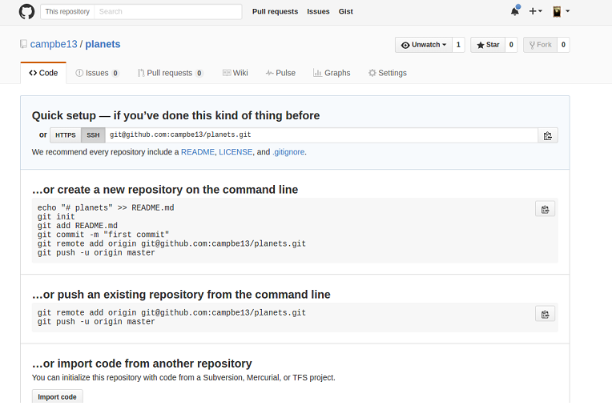

<!-- START doctoc generated TOC please keep comment here to allow auto update -->
<!-- DON'T EDIT THIS SECTION, INSTEAD RE-RUN doctoc TO UPDATE -->
**Table of Contents**  *generated with [DocToc](https://github.com/thlorenz/doctoc)*

- [Git Tutorial, Part 1](#git-tutorial-part-1)
  - [Create a local repo](#create-a-local-repo)
  - [Add files to the repo](#add-files-to-the-repo)
    - [Possible status of files in a git repo](#possible-status-of-files-in-a-git-repo)
  - [Create commits](#create-commits)
    - [Commit messages](#commit-messages)
  - [More commits!](#more-commits)
  - [Set up a server side repo (a remote repo)](#set-up-a-server-side-repo-a-remote-repo)
    - [Creating an empty repo on a server](#creating-an-empty-repo-on-a-server)
  - [Add a remote (to your local repo)](#add-a-remote-to-your-local-repo)
  - [Push the local repo to the remote repo](#push-the-local-repo-to-the-remote-repo)
  - [Review: (changes) then add, commit, push](#review-changes-then-add-commit-push)
  - [Using your repo from a new computer](#using-your-repo-from-a-new-computer)
    - [clone](#clone)
    - [Collaborate... with your future self.](#collaborate-with-your-future-self)
    - [Using your repo back on the first computer (in the lab)](#using-your-repo-back-on-the-first-computer-in-the-lab)
    - [Ahhh! What happens if I forget to pull from `origin` before I commit new changes locally!!](#ahhh-what-happens-if-i-forget-to-pull-from-origin-before-i-commit-new-changes-locally)

<!-- END doctoc generated TOC please keep comment here to allow auto update -->

# Git Tutorial, Part 1

Summary: create a local repository, make commits, set up a remote repository,
push to and pull from the remote.

Commands shown: `git init`, `git status`, `git add`, `git commit`, `git diff`,
`git log`, `git clone`, `git remote`, `git push`, `git pull`

## Create a local repo

(Adapted from: <http://swcarpentry.github.io/git-novice/03-create/>)

We are going to make an example local repository. Do this on
the h: drive in the lab, it may be done anywhere in reality.

``` {.bash}
$ mkdir planets
$ cd planets
```

Make the directory into a git repository; pwd is h:\\planets

``` {.bash}
$ pwd
/h/planets
$  git init .
Initialized empty Git repository in H:/planets/.git/
```

>Now h:\\planets is a git repo

Check that there's a `.git` directory in `planets`, and check the status
of the repository.

```
$ ls -a   
.  ..  .git
$ git status
On branch master  <--- we'll learn about branches later

Initial commit

nothing to commit (create/copy files and use "git add" to track)
```

_Use `git status` often: it can give you hints about how to fix mistakes._

## Add files to the repo

(Adapted from: <http://swcarpentry.github.io/git-novice/04-changes/>)

Create a file in the planets directory

>instead of notepad here, use vi if you are familiar with it
  1. i > insert
  2. type in your text
  3. esc + :wq   >write and save

``` {.bash}
$ notepad pluto.txt   #  put some text in here "alas it is no more"  
                      #  with notepad save as h:\planets\pluto.txt & close it
$ git status

On branch master

Initial commit

Untracked files:
 (use "git add <file>..." to include in what will be committed)
       pluto.txt
nothing added to commit but untracked files present (use "git add" to track)
```

git does not pay attention to changes in a file until you `add` it to the repo. This
tells git to "stage" your file in the __staging area__: this represents the changes
that will be recorded in your repo history if you decide to commit them.

``` {.bash}
$ git add pluto.txt
$ git status  
On branch master

Initial commit

Changes to be committed:
   (use "git rm --cached <file>..." to unstage)

   new file:   pluto.txt

```

### Possible status of files in a git repo
`untracked`:
Files that aren't tracked by Git yet. This usually indicates a newly created file.

`staged` (in the staging area):
The result of `git add`; tracked files that are ready to be committed.

`unstaged` (not in the staging area):
Tracked files with changes that have not been "git-added".


You can see the staged changes as follows:

```{.bash}
$ git diff --staged

diff --git a/pluto.txt b/pluto.txt
new file mode 100644
index 0000000..d91f233
--- /dev/null
+++ b/pluto.txt
@@ -0,0 +1 @@
+alas it is no more
\ No newline at end of file
```

## Create commits

Tell git save a snapshot of file history by recording the changes that you
added to the staging area.

``` {.bash}
$ git commit -m "Create first planet file."
```
The result of the commit should be:

``` {.bash}
[master (root-commit) f22b25e] Create first planet file.
 1 file changed, 1 insertion(+)
 create mode 100644 pluto.txt
```

Make sure it committed ok

``` {.bash}
$ git status
On branch master
nothing to commit, working directory clean
```

Show all commits in reverse chronological order:

``` {.bash}
$ git log
```

``` {.bash}
commit cad3cf0a910669827d1040fcf2e960090a316a79 (HEAD -> master)
Author: Grace Hopper <gracie@ilovelinux.ca>
Date:   Thu Aug 22 09:51:46 2013 -0400

    Create first planet file.
```

### Commit messages

``` {.bash}
$ git commit -m "Create first planet file.
```
The -m provides a one line commit message. It is a widely adopted practice to start commit messages with an imperative verb, this makes the history easier to read when use `git log` and other tools.

The message "Create first planet file" describes the changes made by that
commit.

## More commits!

You just committed a new file. What does it look like when you commit
changes to an already-tracked file?

``` {.bash}
$ notepad pluto.txt   #  add a new line of text "we miss you pluto"  & save it
$ git status
```

``` {.bash}
# On branch master
# Changes not staged for commit:
#   (use "git add <file>..." to update what will be committed)
#   (use "git checkout -- <file>..." to discard changes in working directory)
#
#   modified:   pluto.txt
#
no changes added to commit (use "git add" and/or "git commit -a")
```

Look at the changes before saving them; git detects that it doesn't match
what is in the first commit

``` {.bash}
git diff
```

Output of git diff:

``` {.bash}
diff --git a/pluto.txt b/pluto.txt
index 9f83956..0ce4e22 100644
--- a/pluto.txt
+++ b/pluto.txt
@@ -1 +1,2 @@
 alas it is no more
+we miss you pluto
```

So now try to commit:

``` {.bash}
$ git commit -m "Add sentiment"
On branch master
Changes not staged for commit:
    modified:   pluto.txt

no changes added to commit

$ git status
```

NOPE!

``` {.bash}
# On branch master
# Changes not staged for commit:
#   (use "git add <file>..." to update what will be committed)
#   (use "git checkout -- <file>..." to discard changes in working directory)
#
#   modified:   pluto.txt
#
no changes added to commit (use "git add" and/or "git commit -a")
```

We need to add it to the index (staging area) before committing: __always add then commit__

``` {.bash}
$ git add pluto.txt
$ git commit -m "Add sentiment"
```

Success!

``` {.bash}
[master 340b5d6] add sentiment
 1 file changed, 1 insertion(+)
```

So getting files into a repo is a two-part process:

untracked changes --(git add)-&gt; staging area --(git commit)--&gt; repository


## Set up a server side repo (a remote repo)

These instructions focus on github, but the process is very similar with
other hosts like gitlab or bitbucket.

You will create an empty public repo on github and then "push" your
local repo to that public location, effectively making a remote copy.

> In this exercise, your remote repo will be _public_.   
> for others you can decide if they will be _private_ or _public_

### Creating an empty repo on a server
1.  If you don't have a github account create one
    <https://github.com/join?source=header-home>
2.  Logon to the gitub site.
3.  To create a new repo click
    on the plus sign:
    _(Do NOT create a README nor any other files)_
    
4.  If the repo is created properly you will see this;
    

Now you have an empty repo called planets on the github server.
Effectively you just did the following on github, but through their web UI:

``` {.bash}
mkdir planets; cd planets; git init .
```

## Add a remote (to your local repo)

We need to connect our local repo to our remote repo. We must tell the local repo
to talk to a remote repo on gitlab.com. This is called __adding a remote__.

> It is better to use ssh but you will need to set up keys > for that. Witth https you
> can use userid/password. So we'll use https for now.

Note: server side == remote && client side == local

From the website copy the https url into your clipboard


Go to your local repo directory (git-bash command line)

Below shows my repo URL, use your own
``` {.bash}
# go into repository directory (you already did a git init here)
$ cd planets

# add a remote with name "origin" and the url from the website
$ git remote add origin https://github.com/campbe13/lab1-using-git.git

# view it to verify
$ git remote -v
origin  https://github.com/campbe13/lab1-using-git.git (fetch)
origin  https://github.com/campbe13/lab1-using-git.git (push)
```

> "origin" is a standard name for the primary remote used by your
> local repo. We could have used any string for this label.

## Push the local repo to the remote repo

Now that the local (client) repo knows about the remote (server) repo, let's
sync them. Your remote repo on gitlab is empty, so let's send your history
from the local repo to the remote repo.

`git push` is the command for sending data to a remote.

Note the files have been committed to the local repository.

``` {.bash}
$ git push origin master
```

So this command is saying: take all the commits in history up to the point
labeled "master" and send them to the remote called "origin"

We need to authenticate on the server:


``` {.bash}
Counting objects: 3, done.
Delta compression using up to 4 threads.
Compressing objects: 100% (2/2), done.
Writing objects: 100% (3/3), 214 bytes | 0 bytes/s, done.
Total 3 (delta 0), reused 0 (delta 0)
To https://github.com/campbe13/planets.git
 * [new branch]      master -> master
```

Reload the project page: you should see that your local history is now on the
server.


## Review: (changes) then add, commit, push

Add a README.md, for now just put in some basic text, you can get more
sophisticated later, with (markdown)[https://help.github.com/articles/basic-writing-and-formatting-syntax/]

Example below:

``` {.bash}
$ echo "# planets" > README.md
$ echo "My first repo" >> README.md
$ git add README.md
$ git commit -m "add readme"     # into local repo
[master ef2c0b8] add readme
 1 file changed, 1 insertion(+)

 create mode 100644 README.md
$ git push origin master         # into remote repo
Counting objects: 3, done.
Delta compression using up to 4 threads.
Compressing objects: 100% (2/2), done.
Writing objects: 100% (3/3), 284 bytes | 0 bytes/s, done.
Total 3 (delta 0), reused 0 (delta 0)
To https://github.com/campbe13/planets.git
   340b5d6..ef2c0b8  master -> master
```

Reload the project page on the github website it will show you the README.md


##  Using your repo from a new computer

Up to now you have a planets.git repo in your h: drive (local), a
planets.git repo on gitlab.com (remote) and they are identical.

Let's say you want to work on the `planets.git` repo on another computer.
To do that, you first have to __clone__ the repository from the remote server.

### clone

__You would normally do this part from a different computer outside of the
lab, but we can simulate it by using a different directory on the same computer.__
To do so in the lab, create a directory called _imaginaryOtherComputer_ in your
h: drive and cd to it.

Again copy the https url from the planets repo project page in your github account
and use `git clone` as you see below:

``` {.bash}
$ cd  /h
$ mkdir imaginaryOtherComputer
$ cd imaginaryOtherComputer
$ git clone https://github.com/yourid/planets.git
Cloning into 'planets'...
remote: Counting objects: 9, done.
remote: Compressing objects: 100% (4/4), done.
remote: Total 9 (delta 0), reused 9 (delta 0), pack-reused 0
Unpacking objects: 100% (9/9), done.
Checking connectivity... done.

$ cd planets
$ ls -l
total 8
-rw-rw-r-- 1 tricia tricia 38 Aug 28 19:51 pluto.txt
-rw-rw-r-- 1 tricia tricia 14 Aug 28 19:51 README.md
```

Because my repo is called planets.git, this command creates a new __planets__
directory in the current directory (_imaginaryOtherComputer_ directory).

By default, cloning will
set up a remote called "origin" for you that points to the remote URL you cloned from.
``` {.bash}
$ git remote -v
origin  https://github.com/campbe13/planets.git (fetch)
origin  https://github.com/campbe13/planets.git (push)
```

So now you have 3 identical copies of this repository:
1. on your h: drive
2. on github
3. on your home computer (or wherever you cloned just now, like the _imaginaryOtherComputer_ directory).

### Collaborate... with your future self.

In this workflow scenario, every time you commit changes locally, you will push them to
the remote so you can access your latest changes wherever you are working next
time.

Modify some files in the repo you just cloned, and/or create new ones.
I added `home-planet.txt` and changed `README.md`

``` {.bash}
$ vi home-planet.txt
$ ls -l
total 12
-rw-rw-r-- 1 tricia tricia 32 Aug 28 19:54 home-planet.txt
-rw-rw-r-- 1 tricia tricia 38 Aug 28 19:51 pluto.txt
-rw-rw-r-- 1 tricia tricia 14 Aug 28 19:51 README.md
$ vi README.md
$ git diff
diff --git a/README.md b/README.md
index b85b88f..cc8bdcd 100644
--- a/README.md
+++ b/README.md
@@ -1 +1,3 @@
 # planets
 My first repo
+fixed the thingy error
```
I changed the local files, the other repos are not changed.  I must explicitly update the remote:

``` {.bash}
$ git add .
$ git status
On branch master
Your branch is up-to-date with 'origin/master'.
Changes to be committed:
  (use "git reset HEAD <file>..." to unstage)

    modified:   README.md
    new file:   home-planet.txt
```

`add` will update the staging area, `commit` will save to the local repo

``` {.bash}
$ git commit -m "done for today will work from school tomorrow"
[master c3993b1] done for today will work from school tomorrow
 2 files changed, 3 insertions(+)
 create mode 100644 home-planet.txt
```

I need to push these changes to the remote repo.

``` {.bash}
$ git push origin master
...
Counting objects: 4, done.
Delta compression using up to 4 threads.
Compressing objects: 100% (3/3), done.
Writing objects: 100% (4/4), 432 bytes | 0 bytes/s, done.
Total 4 (delta 0), reused 0 (delta 0)
To https://github.com/campbe13/planets.git
   ef2c0b8..c3993b1  master -> master
```

Now the remote (server) github repo contains my latest changes.

### Using your repo back on the first computer (in the lab)

__You would normally do this part from a different computer, but we can simulate it by using a different directory on the same computer.__ To do so in the lab, cd back to
where you originally created the planets repo on your h: drive at the beginning of this
tutorial.

So you committed a change in the repo at home, pushed to your remote, and now
you want to work on the repo in the school lab again. Your home and remote
repo are up-to-date, but your lab repo is not. How do you get the
changes you made at home? Follow the example below.

Before you make any new changes in your local lab repo, make sure you sync it
with any changes from the remote (gitlab) with `git pull`.

``` {.bash}
$ cd /h/planets
$ ls
pluto.txt  README.md
$ git pull origin master
From https://gitlab.com/campbe13/planets
 * branch            master     -> FETCH_HEAD
Updating ef2c0b8..c3993b1
Fast-forward
 README.md       | 1 +
 home-planet.txt | 2 ++
 2 files changed, 3 insertions(+)
 create mode 100644 home-planet.txt
```

Now your local repo matches the remote (gitlab) and you can add new
changes and to the remote again as needed.

``` {.bash}
$ ls -l
total 12
-rw-rw-r-- 1 tricia tricia 32 Aug 28 20:07 home-planet.txt
-rw-rw-r-- 1 tricia tricia 38 Aug 28 17:12 pluto.txt
-rw-rw-r-- 1 tricia tricia 57 Aug 28 20:07 README.md
```

Added a file important-work.txt and update home-planet.txt

``` {.bash}
$ git status
On branch master
Your branch is up-to-date with 'origin/master'.
Changes not staged for commit:
  (use "git add <file>..." to update what will be committed)
  (use "git checkout -- <file>..." to discard changes in working directory)

    modified:   home-planet.txt

Untracked files:
  (use "git add <file>..." to include in what will be committed)

    important-work.txt

no changes added to commit (use "git add" and/or "git commit -a")
```

So I need to add the new file (stage), then commit them (save history in local
repo)

``` {.bash}
$ git add .
$ git commit -m "Add important new stuff."
[master f843520] Add important new stuff.
 2 files changed, 3 insertions(+)
 create mode 100644 important-work.txt
$ git status
On branch master
Your branch is ahead of 'origin/master' by 1 commit.
  (use "git push" to publish your local commits)
nothing to commit, working directory clean
```

Then I need to push to my remote (github) to update it.

> Recall: "origin" is just a label for the remote URL.

``` {.bash}
$ git push origin master
...
Counting objects: 4, done.
Delta compression using up to 4 threads.
Compressing objects: 100% (3/3), done.
Writing objects: 100% (4/4), 440 bytes | 0 bytes/s, done.
Total 4 (delta 0), reused 0 (delta 0)
To https://github.com/campbe13/planets.git
   c3993b1..f843520  master -> master
```

### Ahhh! What happens if I forget to pull from `origin` before I commit new changes locally!!

Don't worry, you can fix pretty much any mistake you make in git, although it might
be a bit tricky sometimes.

If you pull after you've already made commits locally, you will either "merge"
or "rebase" the commits. You may also have to fix some "conflicts". You can
even "rewrite history". These are
all things that we'll practice later on, so for now just ask me for help. :)
