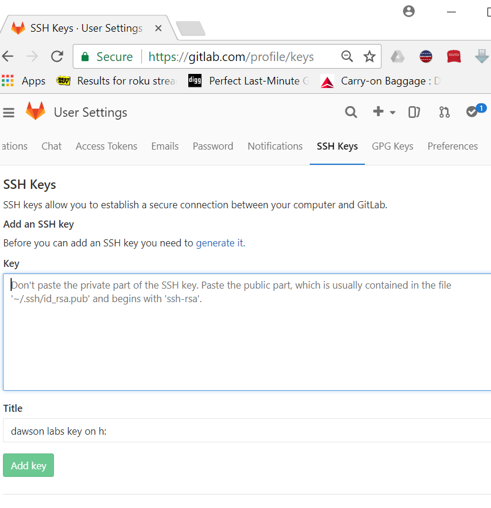

# adding a key to the gitlab hosts

1. Logon to gitlab
2. In the upper-right corner of any page, click your profile photo, then click _Settings_
3. One of the options shown will be _SSH Keys_
... 
4. in the section marked _key_ paste in the contents of the clipboard Done in the previous step, remember:
... .
```{.bash}
clip < .ssh/id_rsa.pub
```
5. Click on add key

__ta da!!! you are finished you can now use ssh URLs with gitlab__
